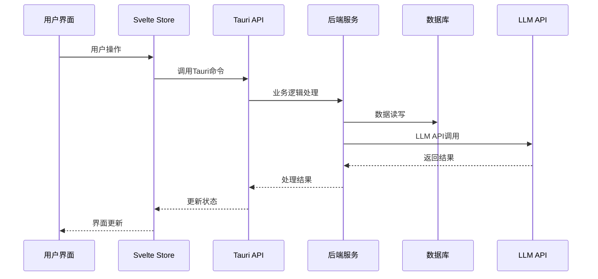

# HandBox 技术架构文档

## 1. 架构概览

HandBox 采用基于 Tauri 的桌面应用架构，结合 Svelte 前端框架和 Rust 后端，提供高性能的原生化AI工具体验。

### 1.1 整体架构图

```
┌─────────────────────────────────────────────────────────────┐
│                        用户界面层 (UI Layer)                     │
├─────────────────────────────────────────────────────────────┤
│                 Svelte + TypeScript 前端                     │
│  ┌─────────────┐ ┌─────────────┐ ┌─────────────┐            │
│  │   对话组件    │ │  Prompt管理  │ │  Agent管理   │            │
│  └─────────────┘ └─────────────┘ └─────────────┘            │
├─────────────────────────────────────────────────────────────┤
│                      桥接层 (Bridge Layer)                    │
│                        Tauri API                           │
├─────────────────────────────────────────────────────────────┤
│                   业务逻辑层 (Business Logic)                 │
│  ┌─────────────┐ ┌─────────────┐ ┌─────────────┐            │
│  │   LLM管理    │ │   记忆系统    │ │   工具集成    │            │
│  └─────────────┘ └─────────────┘ └─────────────┘            │
├─────────────────────────────────────────────────────────────┤
│                     数据持久层 (Data Layer)                   │
│  ┌─────────────┐ ┌─────────────┐ ┌─────────────┐            │
│  │   SQLite    │ │   向量数据库   │ │   文件系统    │            │
│  └─────────────┘ └─────────────┘ └─────────────┘            │
├─────────────────────────────────────────────────────────────┤
│                     外部服务层 (External Layer)               │
│  ┌─────────────┐ ┌─────────────┐ ┌─────────────┐            │
│  │  OpenAI API │ │  Claude API  │ │   其他LLM    │            │
│  └─────────────┘ └─────────────┘ └─────────────┘            │
└─────────────────────────────────────────────────────────────┘
```

## 2. 技术栈选型

### 2.1 前端技术栈

#### 2.1.1 Svelte 5 + TypeScript
**选择理由**:
- **性能优势**: 编译时优化，运行时开销小
- **开发体验**: 简洁的语法，较少的样板代码
- **体积优势**: 打包后体积小，适合桌面应用
- **类型安全**: TypeScript提供完整的类型检查

#### 2.1.2 Svelte Kit
**选择理由**:
- **路由管理**: 文件系统路由，结构清晰
- **状态管理**: 内置stores，简单高效
- **构建工具**: 集成Vite，开发体验好
- **SSG支持**: 静态生成，适合Tauri打包

#### 2.1.3 UI组件库和样式
- **Tailwind CSS**: 实用优先的CSS框架
- **Lucide Icons**: 轻量级图标库
- **Monaco Editor**: 代码编辑器（Prompt编辑）
- **Chart.js**: 数据可视化图表

### 2.2 后端技术栈

#### 2.2.1 Tauri + Rust
**选择理由**:
- **性能**: Rust的零成本抽象和内存安全
- **体积**: 相比Electron更小的应用体积
- **安全**: Rust的内存安全特性
- **跨平台**: 一次编写，多平台运行

#### 2.2.2 核心依赖库
```toml
[dependencies]
tauri = { version = "2.0", features = ["api-all"] }
serde = { version = "1.0", features = ["derive"] }
tokio = { version = "1.0", features = ["full"] }
sqlx = { version = "0.7", features = ["sqlite", "runtime-tokio-native-tls"] }
reqwest = { version = "0.11", features = ["json"] }
uuid = { version = "1.0", features = ["v4"] }
chrono = { version = "0.4", features = ["serde"] }
anyhow = "1.0"
thiserror = "1.0"
```

### 2.3 数据存储

#### 2.3.1 SQLite 数据库
**用途**: 结构化数据存储
- 用户配置信息
- 对话历史记录
- Prompt模板
- Agent定义

#### 2.3.2 向量数据库
**选择**: Qdrant (embedded mode) 或 自实现
**用途**: 语义搜索和记忆系统
- 文档向量化存储
- 相似度检索
- 长期记忆管理

#### 2.3.3 文件系统
**用途**: 非结构化数据存储
- 上传的文档文件
- 导出的数据备份
- 插件和扩展文件

## 3. 模块化设计

### 3.1 前端模块结构

```
src/
├── lib/                          # 共享组件和工具
│   ├── components/               # UI组件
│   │   ├── Chat/                # 对话相关组件
│   │   ├── Prompt/              # Prompt管理组件
│   │   ├── Agent/               # Agent管理组件
│   │   └── Common/              # 通用组件
│   ├── stores/                   # Svelte状态管理
│   │   ├── chat.ts              # 对话状态
│   │   ├── prompt.ts            # Prompt状态
│   │   ├── agent.ts             # Agent状态
│   │   └── settings.ts          # 设置状态
│   ├── types/                    # TypeScript类型定义
│   ├── utils/                    # 工具函数
│   └── api/                      # API调用封装
├── routes/                       # 页面路由
│   ├── chat/                     # 对话页面
│   ├── prompts/                  # Prompt管理页面
│   ├── agents/                   # Agent管理页面
│   └── settings/                 # 设置页面
└── app.html                      # 应用入口
```

### 3.2 后端模块结构

```
src-tauri/src/
├── main.rs                       # 应用入口
├── lib.rs                        # 库入口
├── commands/                     # Tauri命令处理
│   ├── chat.rs                   # 对话相关命令
│   ├── prompt.rs                 # Prompt管理命令
│   ├── agent.rs                  # Agent管理命令
│   └── llm.rs                    # LLM API命令
├── services/                     # 业务服务层
│   ├── llm_service.rs            # LLM集成服务
│   ├── memory_service.rs         # 记忆系统服务
│   ├── tool_service.rs           # 工具集成服务
│   └── database_service.rs       # 数据库服务
├── models/                       # 数据模型
│   ├── chat.rs                   # 对话模型
│   ├── prompt.rs                 # Prompt模型
│   └── agent.rs                  # Agent模型
├── utils/                        # 工具函数
└── config/                       # 配置管理
```

## 4. 数据流架构

### 4.1 请求-响应流程



### 4.2 状态管理流程

#### 4.2.1 Svelte Stores 设计
```typescript
// 对话状态管理
export interface ChatState {
  sessions: ChatSession[];
  activeSessionId: string | null;
  isLoading: boolean;
  selectedModel: string;
  parameters: ModelParameters;
}

// Prompt状态管理
export interface PromptState {
  prompts: PromptTemplate[];
  categories: Category[];
  activePrompt: PromptTemplate | null;
  searchQuery: string;
}

// Agent状态管理
export interface AgentState {
  agents: Agent[];
  activeAgent: Agent | null;
  availableTools: Tool[];
  memoryStats: MemoryStats;
}
```

## 5. LLM集成架构

### 5.1 统一API抽象

```rust
#[async_trait]
pub trait LLMProvider {
    async fn chat_completion(&self, request: ChatRequest) -> Result<ChatResponse>;
    async fn stream_chat(&self, request: ChatRequest) -> Result<ChatStream>;
    fn supports_feature(&self, feature: LLMFeature) -> bool;
    fn get_models(&self) -> Vec<ModelInfo>;
}

// 具体实现
pub struct OpenAIProvider;
pub struct ClaudeProvider;
pub struct GeminiProvider;
```

### 5.2 模型管理系统

```rust
pub struct ModelManager {
    providers: HashMap<String, Box<dyn LLMProvider>>,
    model_configs: HashMap<String, ModelConfig>,
}

impl ModelManager {
    pub async fn send_message(&self, model: &str, message: ChatMessage) -> Result<String>;
    pub fn get_available_models(&self) -> Vec<ModelInfo>;
    pub fn update_model_config(&mut self, model: &str, config: ModelConfig);
}
```

## 6. 记忆系统架构

### 6.1 多层记忆结构

```rust
pub struct MemorySystem {
    short_term: ShortTermMemory,    // 会话级记忆
    long_term: LongTermMemory,      // 持久化记忆
    vector_store: VectorStore,      // 向量检索
}

// 短期记忆 - 会话内容
pub struct ShortTermMemory {
    conversation_history: Vec<ChatMessage>,
    context_window: usize,
}

// 长期记忆 - 跨会话知识
pub struct LongTermMemory {
    knowledge_base: Vec<MemoryChunk>,
    user_preferences: UserPreferences,
    learned_patterns: Vec<Pattern>,
}

// 向量存储 - 语义检索
pub struct VectorStore {
    embeddings: Vec<(String, Vec<f32>)>,
    index: VectorIndex,
}
```

### 6.2 记忆检索策略

1. **相关性检索**: 基于向量相似度的语义检索
2. **时间衰减**: 根据时间权重调整记忆重要性
3. **频率统计**: 高频访问的记忆优先级提升
4. **用户反馈**: 根据用户标记调整记忆权重

## 7. 工具集成架构

### 7.1 工具抽象接口

```rust
#[async_trait]
pub trait Tool {
    fn name(&self) -> &str;
    fn description(&self) -> &str;
    fn parameters(&self) -> &[Parameter];
    async fn execute(&self, params: Value) -> Result<ToolResult>;
}

// 内置工具实现
pub struct FileOperationTool;
pub struct WebSearchTool;
pub struct CodeExecutorTool;
pub struct CalculatorTool;
```

### 7.2 代码执行环境

```rust
pub struct CodeExecutor {
    sandbox: SandboxEnvironment,
    timeout: Duration,
    memory_limit: usize,
}

impl CodeExecutor {
    pub async fn execute_python(&self, code: &str) -> Result<ExecutionResult>;
    pub async fn execute_javascript(&self, code: &str) -> Result<ExecutionResult>;
    pub fn validate_code(&self, code: &str, language: &str) -> Result<()>;
}
```

## 8. 安全架构

### 8.1 数据安全
- **加密存储**: API密钥使用AES-256加密
- **本地存储**: 所有数据存储在本地，不上传云端
- **权限控制**: 最小权限原则，按需申请系统权限

### 8.2 执行安全
- **沙箱隔离**: 代码执行在隔离环境中
- **资源限制**: CPU、内存、网络访问限制
- **输入验证**: 严格的输入参数验证

### 8.3 网络安全
- **HTTPS**: 所有外部API调用使用HTTPS
- **证书验证**: 验证SSL证书有效性
- **请求限制**: API调用频率限制和超时控制

## 9. 性能优化

### 9.1 前端优化
- **懒加载**: 组件和路由按需加载
- **虚拟滚动**: 大列表虚拟化渲染
- **缓存策略**: 合理的数据缓存机制
- **代码分割**: 按功能模块分割代码

### 9.2 后端优化
- **连接池**: 数据库连接复用
- **异步处理**: 非阻塞I/O操作
- **缓存机制**: 热数据内存缓存
- **批处理**: 批量数据库操作

### 9.3 系统优化
- **资源管理**: 及时释放不用的资源
- **内存监控**: 内存使用量监控和优化
- **启动优化**: 应用启动时间优化

## 10. 扩展性设计

### 10.1 插件系统
```rust
pub trait Plugin {
    fn name(&self) -> &str;
    fn version(&self) -> &str;
    fn init(&mut self) -> Result<()>;
    fn shutdown(&mut self) -> Result<()>;
}

pub struct PluginManager {
    plugins: Vec<Box<dyn Plugin>>,
}
```

### 10.2 主题系统
- **CSS变量**: 使用CSS自定义属性
- **动态切换**: 运行时主题切换
- **用户自定义**: 支持用户自定义主题

### 10.3 国际化支持
- **多语言**: 支持中英文等多种语言
- **动态切换**: 运行时语言切换
- **本地化**: 时间、日期、数字格式本地化

## 11. 监控和日志

### 11.1 应用监控
- **性能指标**: CPU、内存、响应时间
- **错误追踪**: 异常和错误日志
- **用户行为**: 功能使用统计

### 11.2 日志系统
```rust
use tracing::{info, warn, error, debug};

// 结构化日志
#[derive(Debug, Serialize)]
struct LogEvent {
    timestamp: DateTime<Utc>,
    level: String,
    message: String,
    module: String,
    user_id: Option<String>,
}
```

这个技术架构文档将指导整个开发过程，确保系统的可扩展性、可维护性和性能表现。