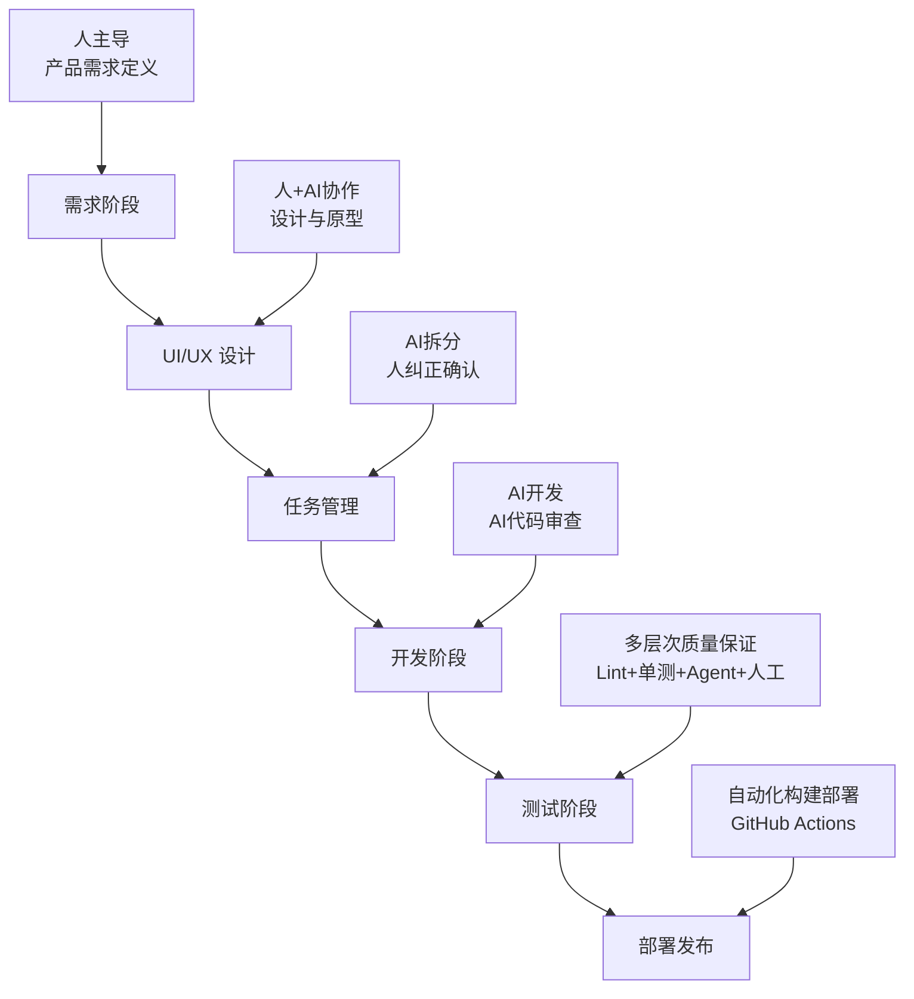

# HandBox 开发指南

本指南定义了 HandBox 项目的完整开发工作流，基于个人开发者与 AI 协作的最佳实践，旨在通过人机协作实现高质量、高效率的软件开发。

## 📋 工作流概览

HandBox 采用五阶段开发工作流，明确定义人与 AI 在各阶段的分工：



### 🎯 各阶段分工说明

| 阶段 | 主导者 | 协作方式 | 产出物 |
|------|--------|----------|--------|
| **需求阶段** | 👨‍💻 人 | 独立主导，明确产品方向 | PRD、设计图 |
| **UI/UX 设计** | 👨‍💻 人 + 🤖 AI | 人提供创意，AI 辅助实现 | 设计原型、组件库 |
| **任务管理** | 🤖 AI | AI 拆分任务，人审核纠正 | 任务清单、里程碑 |
| **开发阶段** | 🤖 AI | AI 编码，AI Agent 代码审查 | 功能代码、测试代码 |
| **测试阶段** | 👨‍💻 人 + 🤖 AI | 多层次自动化 + 人工验收 | 质量报告、发布版本 |

## 🚀 环境准备

### 系统要求
- Node.js 18+
- Rust stable
- Git 2.30+

### 平台依赖
- **macOS**: Xcode Command Line Tools (`xcode-select --install`)
- **Windows**: Visual Studio Build Tools、WebView2
- **Linux**: `libwebkit2gtk-4.0-dev`、`libssl-dev`、`libgtk-3-dev`

### 开发工具安装
```bash
# Tauri CLI
npm i -g @tauri-apps/cli

# 项目依赖
npm install

# 验证环境
npm run check
cargo fmt -- --check
cargo test
```

## 📐 项目结构

```
handbox/
├── docs/                          # 📚 项目文档
│   ├── requirements.md            # 产品需求文档 (人主导)
│   ├── architecture.md            # 架构设计文档
│   ├── tasks.md                   # 任务管理清单 (AI拆分)
│   ├── development.md             # 本开发指南
│   └── resources/                 # 设计资源 (人+AI)
├── src/                           # 🎨 前端代码
│   ├── lib/                       # 核心库
│   │   ├── components/            # UI 组件
│   │   ├── stores/                # 状态管理
│   │   ├── api/                   # IPC 封装
│   │   ├── types/                 # TypeScript 类型
│   │   └── utils/                 # 工具函数
│   └── routes/                    # 页面路由
│       ├── chat/                  # 聊天界面
│       ├── settings/              # 设置页面
│       ├── artifacts/             # Artifact 管理
│       └── search/                # 历史搜索
├── src-tauri/                     # ⚙️ 后端代码
│   ├── src/
│   │   ├── commands/              # IPC 命令 (AI开发)
│   │   ├── services/              # 业务逻辑 (AI开发)
│   │   ├── models/                # 数据模型 (AI开发)
│   │   ├── utils/                 # 工具函数
│   │   └── config/                # 配置管理
│   ├── migrations/                # 数据库迁移
│   └── tests/                     # 单元测试 (AI开发)
├── .github/                       # 🔄 CI/CD 配置
│   └── workflows/                 # GitHub Actions
└── CLAUDE.md                      # 🤖 AI 协作指南
```

## 🔄 开发工作流详解

### 阶段一：需求阶段 (👨‍💻 人主导)

**目标**: 明确产品定位、用户需求和功能范围

**工作内容**:
- 编写产品需求文档 (PRD)
- 定义用户故事和验收标准
- 创建功能优先级矩阵
- 绘制用户流程图

**产出物**:
- `docs/requirements.md` - 完整 PRD
- `docs/resources/` - 原型图和流程图

**质量标准**:
- PRD 包含明确的功能描述和验收标准
- 覆盖所有核心用户场景
- 定义清晰的非功能性需求

### 阶段二：UI/UX 设计 (👨‍💻 人 + 🤖 AI 协作)

**目标**: 创建用户界面设计和交互原型

**协作方式**:
1. **人**: 提供设计理念、品牌风格、交互创意
2. **AI**: 辅助组件设计、样式实现、响应式布局

**工作流程**:
```bash
# 1. 人提供设计灵感和参考
# 2. AI 基于参考创建初版设计
# 3. 人审核调整设计方案
# 4. AI 实现设计组件
# 5. 迭代优化直到满意
```

**产出物**:
- 设计系统和组件库
- 交互原型 (Figma/Sketch)
- 设计规范文档

### 阶段三：任务管理 (🤖 AI 拆分，👨‍💻 人纠正)

**目标**: 将需求和设计转化为可执行的开发任务

**AI 工作职责**:
- 分析 PRD 和设计文档
- 拆解功能为细粒度任务
- 估算任务复杂度和依赖关系
- 生成开发里程碑

**人工审核点**:
- 任务拆分粒度是否合适
- 优先级排序是否合理
- 技术实现路径是否可行
- 里程碑时间安排是否现实

**产出物**:
- `docs/tasks.md` - 详细任务清单
- 开发里程碑规划
- 任务依赖关系图

**使用方法**:
```bash
# AI 生成任务清单
claude "基于 requirements.md 和 architecture.md 生成详细的开发任务清单"

# 人工审核和调整
# 在 tasks.md 中修正任务拆分和优先级
```

### 阶段四：开发阶段 (🤖 AI 开发 + 🤖 AI 代码审查)

**目标**: 高质量代码实现和自动化代码审查

#### 🤖 AI 开发流程

**1. 探索-计划-编码-提交 (Explore-Plan-Code-Commit)**
```bash
# Step 1: 探索现有代码
claude "阅读相关文件，理解当前实现"

# Step 2: 制定实施计划  
claude "为 [任务名称] 创建详细实现计划"

# Step 3: 编码实现
claude "按计划实现功能，遵循项目规范"

# Step 4: 提交变更
git add . && git commit -m "feat: implement [功能名称]"
```

**2. 测试驱动开发 (TDD)**
```bash
# 先写测试
claude "为 [功能名称] 编写单元测试"

# 确认测试失败
cargo test -- --nocapture

# 实现功能使测试通过
claude "实现功能代码，确保测试通过"

# 验证实现
cargo test
```

**3. 视觉迭代开发**
```bash
# 基于设计稿实现
claude "参考设计图实现 UI 组件"

# 截图验证
claude "启动应用并截图当前效果"

# 迭代优化
claude "对比设计稿，优化实现效果"
```

#### 🤖 AI 代码审查流程

**自动化代码审查检查点**:
- 代码风格和格式规范
- 安全性和隐私保护
- 性能和内存使用
- 错误处理和边界情况
- 测试覆盖率和质量

**代码审查工具链**:
```bash
# 静态分析
npm run check        # 前端类型检查
cargo fmt --check    # Rust 格式检查
cargo clippy --deny warnings  # Rust 静态分析

# 安全审计
cargo audit          # 依赖安全检查
npm audit            # 前端依赖检查

# 测试执行
cargo test           # 后端单元测试
npm run test         # 前端测试 (如果有)
```

### 阶段五：测试阶段 (多层次质量保证)

**目标**: 通过多层次自动化和人工验证确保软件质量

#### 🔧 质量保证层次

**1. 静态检查层 (自动化)**
```bash
# 代码格式和规范
npm run check
cargo fmt -- --check
cargo clippy -D warnings

# 依赖安全性
cargo audit
npm audit
```

**2. 单元测试层 (AI + 自动化)**
```bash
# 后端单元测试 (必须)
cargo test

# 前端组件测试 (推荐)
npm run test
```

**3. 功能测试层 (AI Agent)**
```bash
# 使用测试 Agent 执行功能验证
claude "作为测试 Agent，验证 [功能名称] 的完整流程"
```

**4. 人工验收层 (人工)**
- 核心用户流程验证
- UI/UX 体验评估
- 性能基准测试
- 跨平台兼容性检查

#### 📊 质量门禁

**代码合并前必须满足**:
- ✅ 所有静态检查通过
- ✅ 单元测试覆盖率 ≥ 80%
- ✅ 功能测试完整通过
- ✅ 人工验收确认
- ✅ 文档更新完成

## ⚙️ 开发命令参考

### 日常开发
```bash
# 启动开发环境
npm run tauri dev

# 类型检查
npm run check

# 代码格式化
npm run format
cargo fmt

# 运行测试
cargo test
npm test
```

### 质量检查
```bash
# 完整质量检查
npm run check && \
cargo fmt -- --check && \
cargo clippy -D warnings && \
cargo test && \
cargo audit

# 构建验证
npm run tauri build
```

### AI 协作命令
```bash
# 任务分析
claude "分析当前任务，制定实施计划"

# 代码审查
claude "审查最近的代码变更，提供改进建议"

# 测试生成
claude "为新功能生成完整的单元测试"

# 文档更新
claude "根据代码变更更新相关文档"
```

## 🔒 安全与隐私规范

### API Key 管理
- ✅ 使用 OS Keychain 存储 (优先)
- ✅ 本地加密存储 (备选)
- ❌ 明文存储或代码中硬编码
- ❌ 提交到版本控制系统

### 数据隐私
- ✅ 数据默认本地存储
- ✅ 用户显式授权第三方调用
- ✅ 敏感信息排除导出
- ❌ 未经授权的数据上传

### 代码安全
- ✅ 输入验证和参数校验
- ✅ 最小权限原则
- ✅ 安全的子进程管理
- ❌ SQL 注入或 XSS 漏洞

## 📊 性能基准

### 启动性能
- 冷启动时间: < 3 秒
- 首次安装: < 5 秒
- 热重载响应: < 100ms

### 运行时性能
- 空闲内存使用: < 500MB
- 并发会话支持: ≥ 10 个
- UI 操作响应: < 100ms

### 构建性能
- 增量编译: < 30 秒
- 完整构建: < 2 分钟
- 打包输出: < 5 分钟

## 🚀 持续集成 (CI/CD)

### GitHub Actions 工作流

**PR 检查流程**:
```yaml
# .github/workflows/pr-check.yml
- 代码格式检查
- 静态分析
- 单元测试
- 构建验证
- 依赖安全审计
```

**发布流程**:
```yaml
# .github/workflows/release.yml  
- 版本标签检查
- 完整测试套件
- 多平台构建
- 自动发布
```

### 本地预检查
```bash
# 提交前检查 (推荐配置为 git hook)
npm run check && \
cargo fmt -- --check && \
cargo clippy -D warnings && \
cargo test
```

## 📚 协作配置

### CLAUDE.md 配置
在项目根目录创建 `CLAUDE.md`，为 AI 提供项目上下文：

```markdown
# HandBox AI 协作指南

## 项目概述
HandBox 是基于 Tauri + SvelteKit 的本地优先 AI 工作台

## 开发原则
- 遵循 docs/development.md 中的工作流
- 优先安全和隐私保护
- 保持代码简洁和高测试覆盖率

## 技术约束
- 前端：严格 TypeScript，无 any 类型
- 后端：所有 pub 函数必须有单元测试
- IPC：统一错误处理格式

## 常用命令
[列出项目特定的命令和工作流]
```

### 自定义工作流
```bash
# 创建功能分支
git checkout -b feature/[功能名称]

# AI 辅助开发
claude "实现 [功能描述]，遵循项目规范"

# 自动化测试
npm run test:all

# 提交变更
git add . && git commit -m "feat: [功能描述]"

# 推送并创建 PR
git push origin feature/[功能名称]
gh pr create --title "[功能描述]" --body "详细说明..."
```

## 🎯 最佳实践总结

### ✅ 推荐做法
- 明确定义每个阶段的责任人
- 使用 AI 进行重复性编码工作
- 保持高质量的测试覆盖率
- 及时更新文档和注释
- 定期进行代码审查和重构

### ❌ 避免做法
- 跳过需求分析直接编码
- 忽略代码质量检查
- 手动执行可自动化的任务
- 在没有测试的情况下重构
- 忽略安全和性能考虑

---

## 📖 相关文档

- [产品需求文档](./requirements.md) - 功能需求和用户故事
- [架构设计文档](./architecture.md) - 技术架构和设计决策  
- [任务管理文档](./tasks.md) - 开发任务和里程碑
- [Anthropic Claude Code 最佳实践](https://www.anthropic.com/engineering/claude-code-best-practices)

通过遵循本指南，我们能够充分发挥人与 AI 协作的优势，构建高质量的 HandBox 应用。