HandBox 产品需求文档 (PRD)
------

# 1. 产品概述

## 1.1 产品定位
HandBox 是一款面向个人用户的原生化AI工具平台，旨在提供一站式的AI工作环境，让用户能够高效地与多种大语言模型交互，并构建个性化的AI助手。

## 1.2 目标用户
- **AI爱好者**: 希望体验不同AI模型的技术爱好者
- **内容创作者**: 需要AI辅助写作、创意的创作者
- **开发者**: 需要AI辅助编程、调试的程序员
- **研究人员**: 需要AI辅助分析、整理资料的学者
- **知识工作者**: 需要AI提升工作效率的专业人士

## 1.3 核心价值与目标
- 提供本地优先、隐私可控的多模型一站式工作台
- 以可组合的聊天配置（Artifact）沉淀复用能力，降低重复配置成本
- 通过可扩展的卡片化界面与 MCP 工具集成，覆盖从问答到任务编排的复杂用例

## 1.4 非目标（当前版本不覆盖）
- 不提供云端数据同步与团队协作（后续版本评估）
- 不提供模型微调/训练能力（仅推理使用）
- 不内置联网浏览器自动化（通过 MCP 工具或后续插件模式实现）

# 2. 产品需求

## 2.1 与大模型沟通

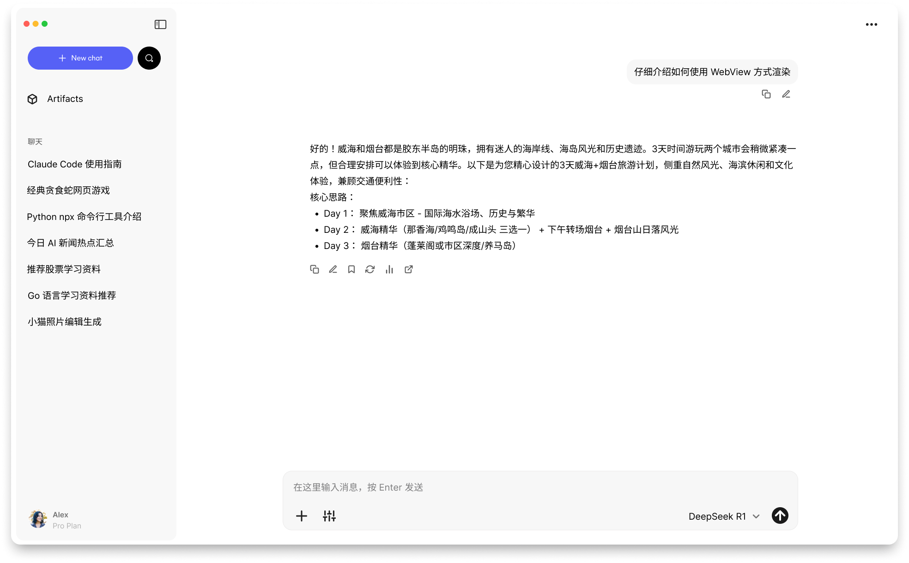

### 2.1.1 聊天模型选择

- 支持模型选择：点击聊天输入框内的模型入口，弹出模型选择弹窗，完成模型切换
- 模型及供应商可通过应用设置进行配置与检测

验收标准：
- 可列出已启用供应商下的可用模型，支持搜索模型名称/ID
- 切换模型后，后续消息使用新模型，且在消息元数据中可见
- 供应商未配置或检测失败时，模型列表给予明确提示

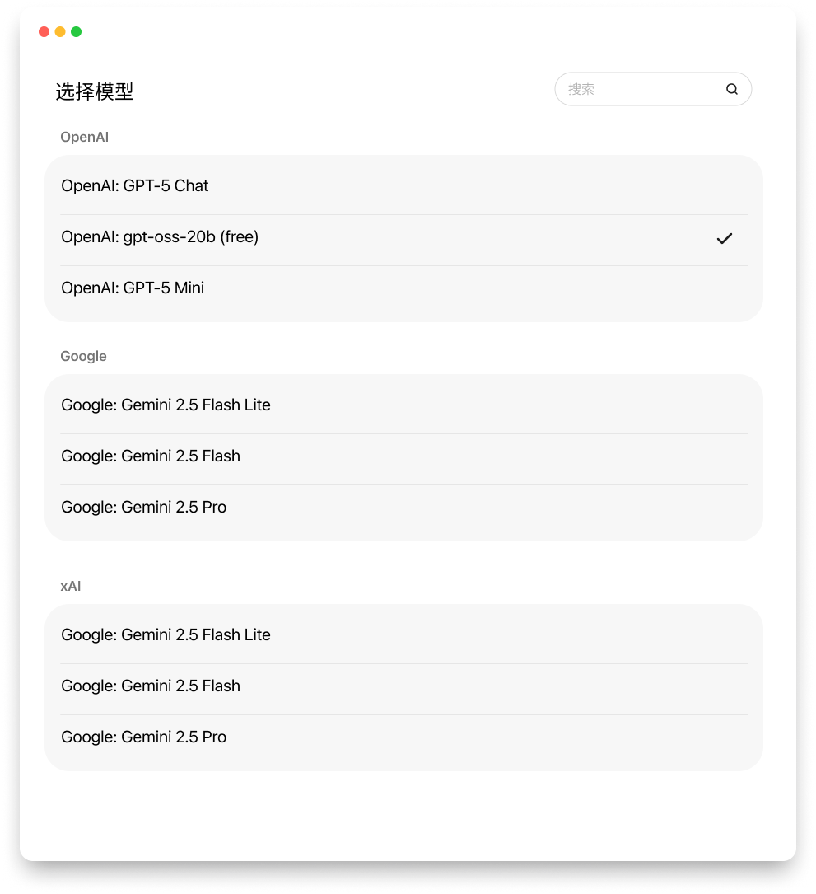

### 2.1.2 发送文字及图片

点击聊天输入框内的“+”按钮，选择本地文件进行发送。

约束与支持：
- 文本：UTF-8，单条消息 ≤ 16K 字符（超限提示截断或分条）
- 图片：支持 PNG/JPEG/WebP，单张 ≤ 10MB，最多 10 张/条消息
- 失败态：不支持的格式/超限时给出可读错误；可重试与替换

### 2.1.3 聊天配置

1. 支持完善的聊天配置，可点击聊天框的设置按钮或聊天框右上角的按钮进行设置
    
    聊天设置包含
    - **系统提示词**（System Prompt）：为聊天定义系统提示词

    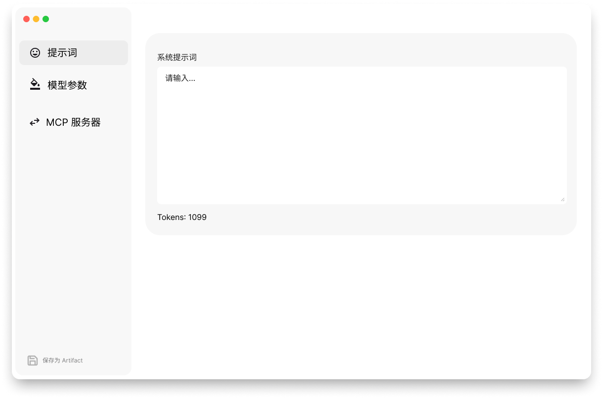

    - **模型参数**：LLM 基础参数配置，包含
        - Temperature
        - Top-P
        - 是否流式输出
        - 最大 Token 数
        - 上下文数

    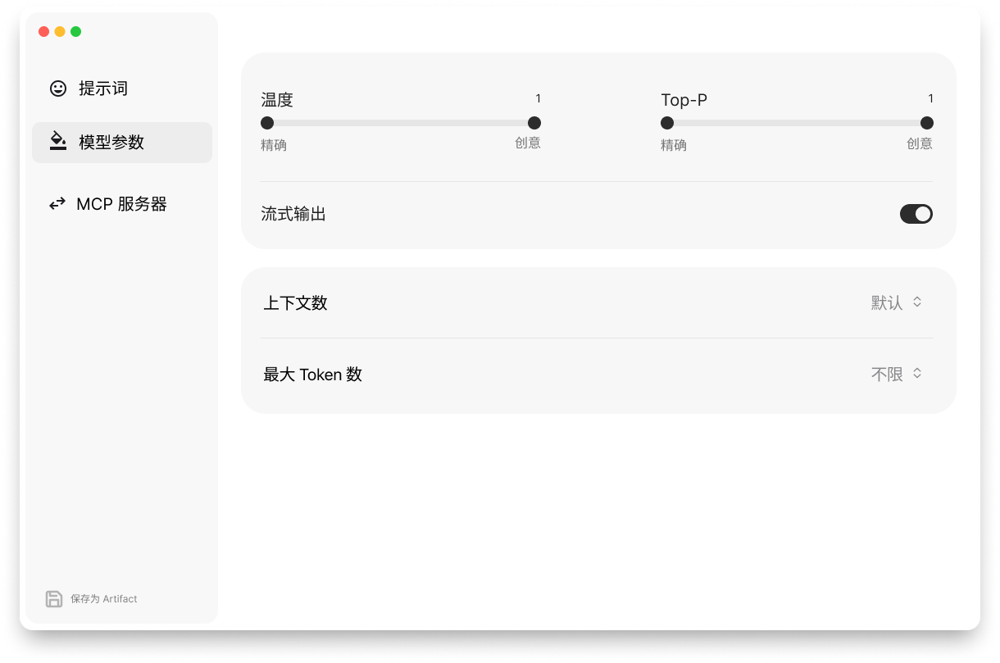

    - **MCP 设置**：从全局 MCP 读取开启的 MCP 服务器，用户在聊天设置中通过 checkbox 选择，开启的关联到当前聊天

    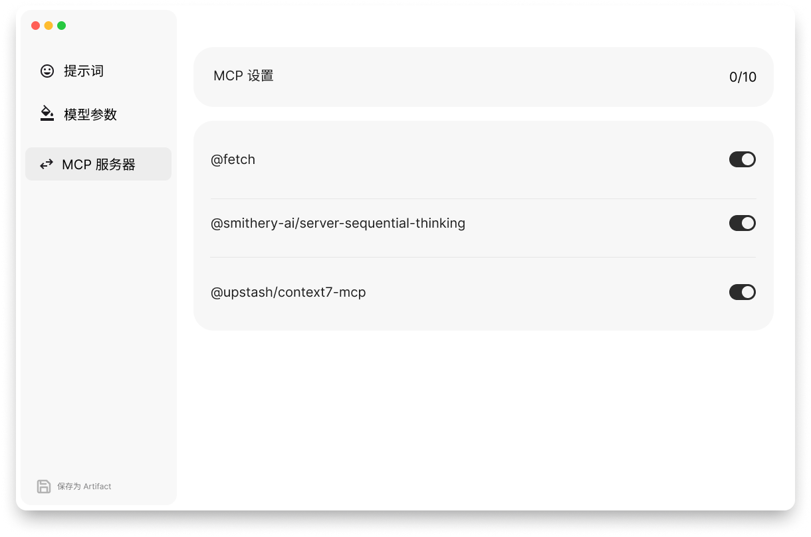

    - **保存 Artifact**：对于可复用的聊天配置，可通过“保存为 Artifact”落盘。保存的 Artifact 会在 Artifact 页面展示

    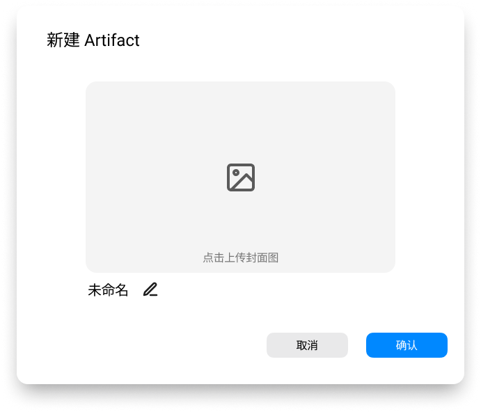

### 2.1.4 聊天内容及配置持久化
通过结构化、可扩展的本地存储保存会话与配置，便于上下文工程与检索。

验收标准：
- 所有消息、消息元数据（时间、模型、耗时、Token）、会话配置均可本地恢复
- 支持导出/导入单会话 JSON，用于备份迁移
- 发生异常退出后，重启可恢复至最近一次已写入状态

### 2.1.5 历史消息搜索
通过点击左侧 Sidebar 的搜索按钮，弹出搜索页面，在本地检索关联会话与消息内容。

验收标准：
- 支持按关键词搜索消息正文与系统提示词；结果按时间与相关性排序
- 支持结果预览与跳转到会话定位
- 索引在本地构建；新增/编辑消息后索引增量更新


## 2.2 具备扩展性的聊天界面


1. 支持完整的 Markdown 渲染，含代码高亮、数学公式、mermaid
2. 聊天支持自定义卡片样式，卡片根据内容组件化、可扩展，如推理模型需要的思考过程卡片、MCP 执行过程卡片等。
3. 对于用户消息支持 “复制”、“编辑”操作
4. 对于 AI 消息支持 “复制”、“编辑”、“收藏”、“刷新”、“元数据信息”（耗时、速度、消耗 Token 数）
5. 对于推理模型，支持“推理过程”展示
6. 支持调用 MCP 过程展示

设计约束：
- 消息为卡片化渲染，卡片类型可扩展（思考过程、工具调用、代码执行）
- Markdown 渲染支持代码高亮、数学公式、Mermaid；超长输出支持折叠与复制

## 2.3 设置管理

### 2.3.1 账户

1. 支持未登录正常使用软件，未登录显示缺省头像和登录按钮

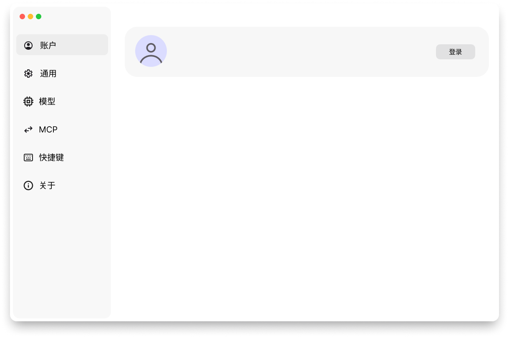

2. 支持 Google 登录，登录后显示用户头像、用户名、邮箱、用户会员状态；点击编辑资料按钮，可以对头像及用户名进行编辑

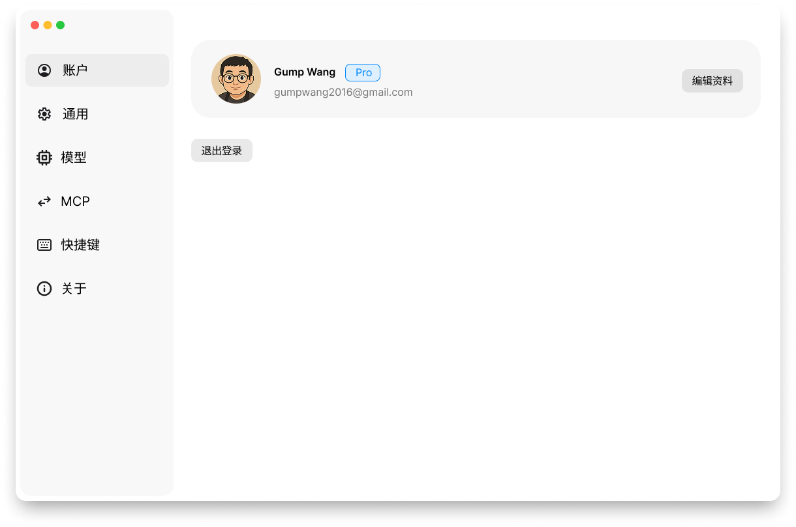
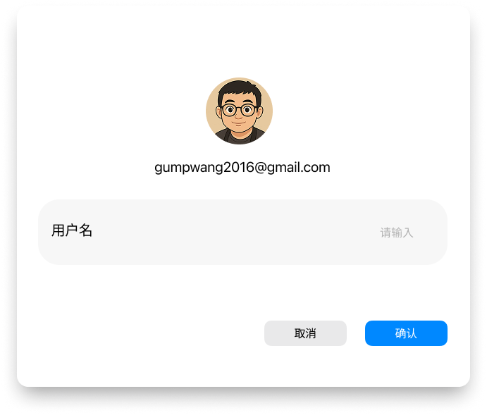

3. 登录/用户管理通过服务端接口进行，假定服务端具备登录、获取资料、退出等接口

验收标准：
- 未登录：显示缺省头像与登录按钮；功能可用但不依赖云端
- 已登录：头像/昵称/邮箱展示；可编辑头像与昵称；登出回到未登录态

### 2.3.2 通用

1. 外观样式：跟随系统（默认）、浅色主题、深色主题
2. 语言：简体中文、English
3. 主题色：跟随系统、蓝色、绿色、红色、黄色、紫色、橙色、粉色、棕色
4. 聊天界面自动下滑：默认开启

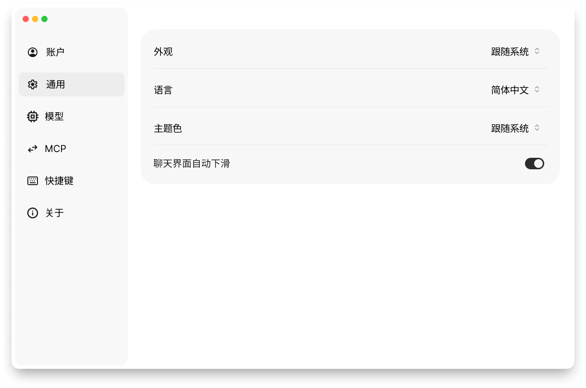

### 2.3.3 模型（管理模型供应商和可接入的模型）

1. 供应商管理
    - 供应商分类
        1. 特定主流供应商，包含：OpenAI、Anthropic、Google AI、DeepSeek、OpenRouter
        2. 自定义供应商，包含：兼容 OpenAI API 的供应商、兼容 Anthropic API 的供应商
    - 供应商配置字段
        1. 对于类型 1 特定主流供应商，配置字段为 API Key、Base URL
        2. 对于类型 2 自定义供应商，配置字段为 API Key、Base URL、名称、供应商类型（兼容 OpenAI API、兼容 Anthropic API）
    - 供应商操作
        1. 对于类型 1 特定主流供应商，支持检测（通过简单的探活消息确认 Key 是否生效）、供应商开关操作（打开后聊天页面可选择该供应商的模型）
        2. 对于类型 2 自定义供应商，支持检测（通过简单的探活消息确认 Key 是否生效）、供应商开关（打开后聊天页面可选择该供应商的模型）、删除操作
2. 模型管理
    - 通过供应商管理页面的 “获取模型列表” 按钮获取该供应商的所有模型，用户选择的模型可以在聊天页面可进行选择使用
    - 模型选择页面支持简单的模型搜索功能，模糊搜索模型名称和 ID

验收标准：
- 新增供应商需通过检测方可启用；失败给出原因与建议
- 获取模型列表异常时需回退与重试；明确速率/鉴权错误提示
- 供应商可禁用/删除；禁用后在聊天页不可选
3. 页面交互方式
    - 供应商列表页，此为模型设置的入口页，展示供应商条目及配置状态，底部为添加供应商按钮

      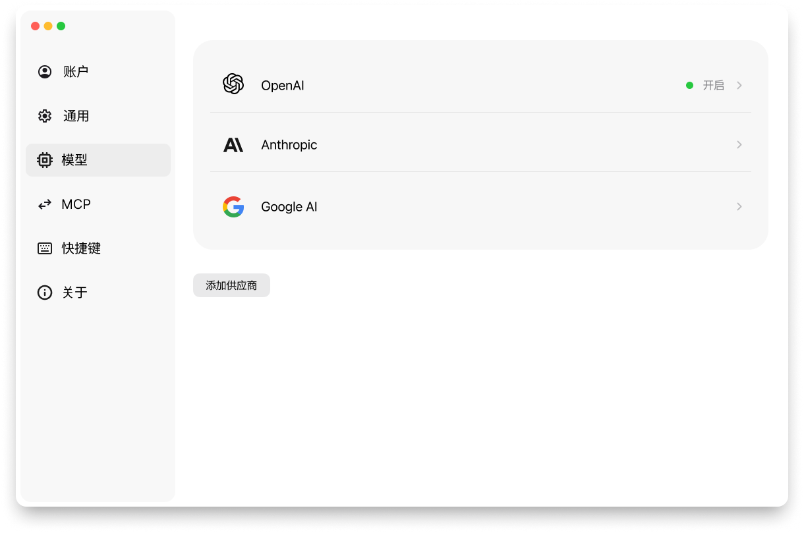

    - 点击供应商列表页面底部的“添加供应商”按钮，弹出添加供应商页面，填写 供应商名称、类型、图标，点击“确认”进入供应商配置页面进行配置

      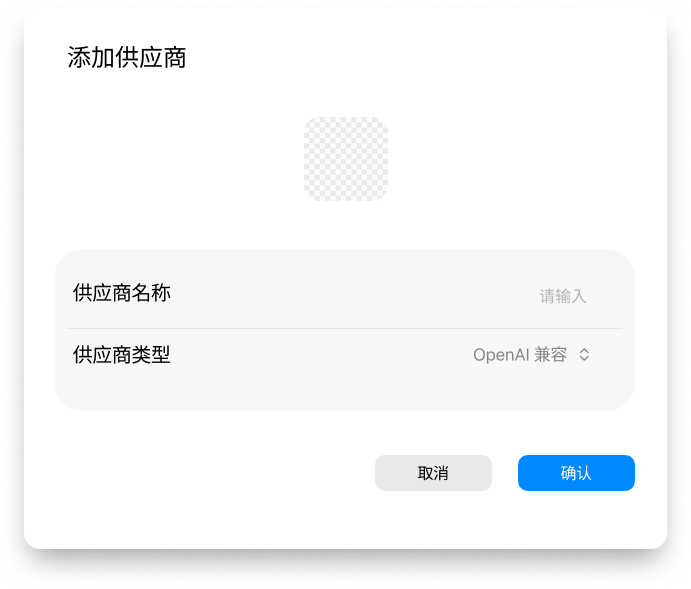

    - 供应商配置页，可以配置供应商的字段、操作供应商可执行的动作

      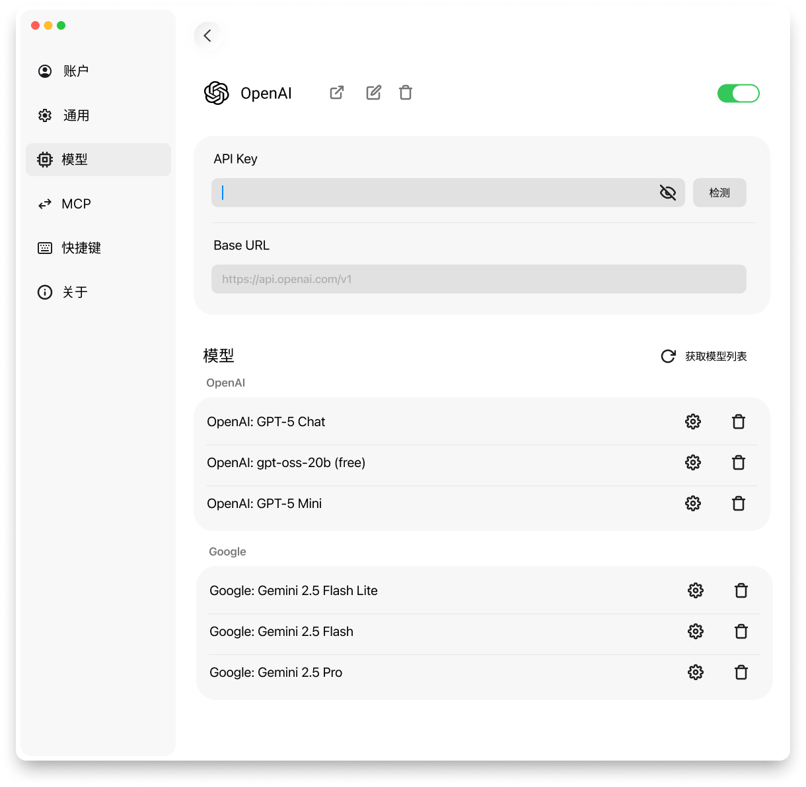

    - 点击供应商配置页的 “获取模型列表” 按钮，弹出模型选择页，用户选择完成后，点击确认或取消关闭页面

      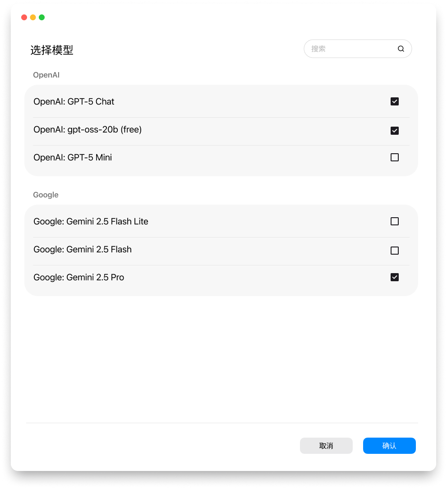


### 2.3.4 MCP

1. 展示 MCP 服务器列表，每个条目有一个开关，用户操作是否打开

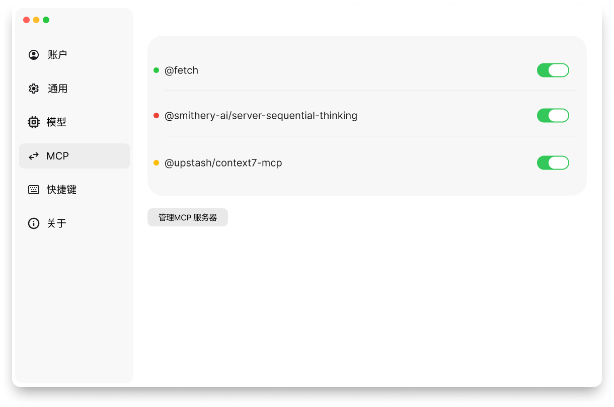

2. 列表底部有 “管理 MCP 服务器”按钮，点击后弹出 “编辑 MCP 服务器” JSON 文件编辑器

最低 JSON 结构要求：
```json
{
  "servers": [
    { "name": "string", "command": "string", "args": ["string"], "enabled": true }
  ]
}
```

验收标准：
- 非法 JSON/字段缺失时给出校验错误与示例
- 启用的 MCP 可在聊天设置中勾选并关联到会话

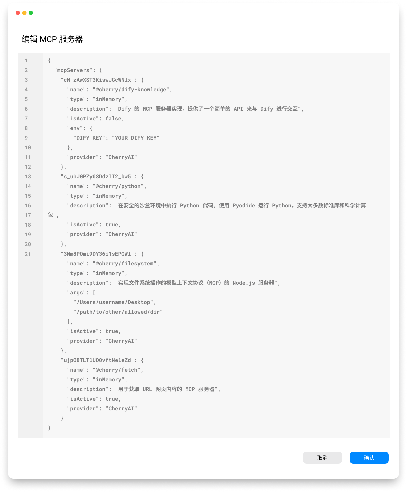

### 2.3.5 快捷键

1. 发送消息：Enter（默认）；Command+Enter/Shift+Enter 插入换行可配置
2. 切换模型：快捷键可选（预留）

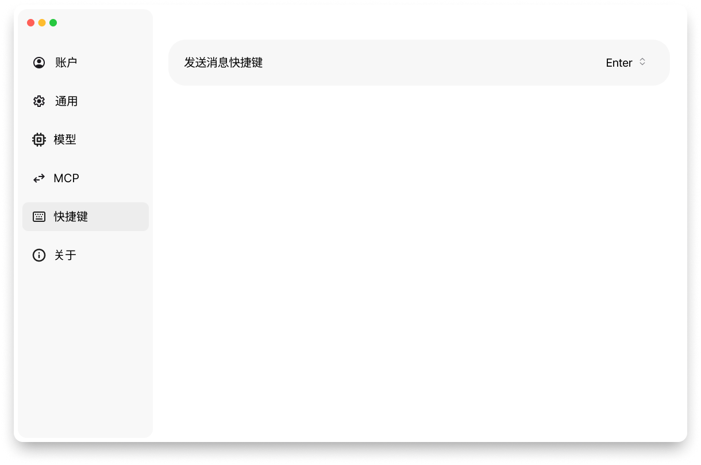


### 2.3.6 关于

1. 检查更新：显示当前版本，点击本行后检查更新
2. 更新日志：通过浏览器跳转到官网 changelog 页面
3. 官方网站：通过浏览器跳转到官网主页
4. 邮箱、Twitter 链接，展示页面底部，点击后复制邮箱地址和跳转到 Twitter 主页

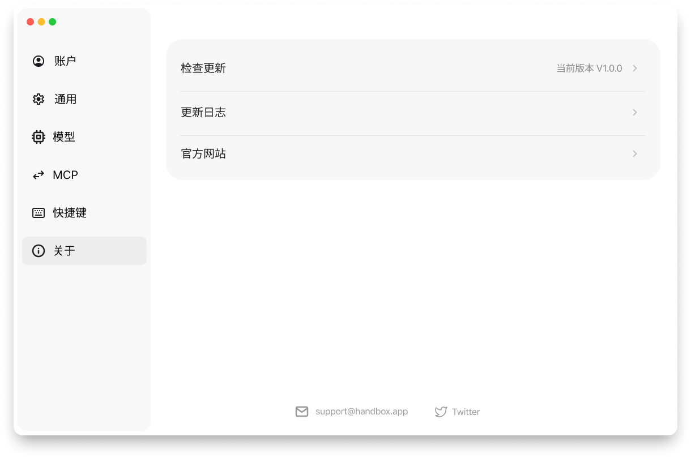

## 2.4 Artifact 管理

Artifact 指一套完整的聊天配置（系统提示词、MCP、模型参数）的合集，方便后续复用同类会话配置

页面展示及交互方式：
- 点击左侧 Sidebar 菜单进入页面，Artifact通过卡片展示
- 点击列表中的某一个 Artifact，弹窗展示聊天配置页面
- 点击卡片上的“使用” 按钮，则基于此 Artifact 新建聊天

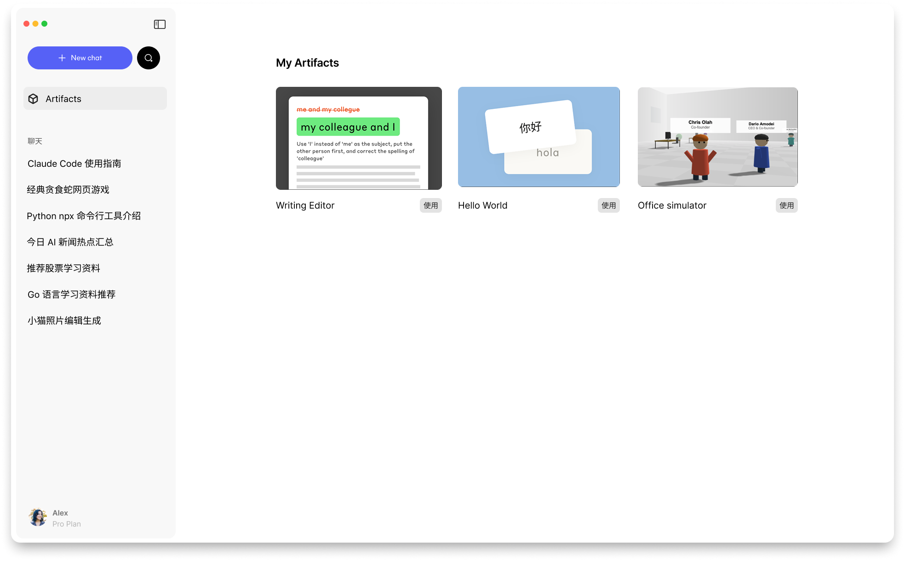

数据字段要求：
- id、名称、描述、创建时间、最近使用时间
- 系统提示词、模型与参数、启用的 MCP 列表

操作验收标准：
- 从聊天保存为 Artifact；在列表可预览、重命名、删除、“使用”创建新聊天
- 删除需二次确认；误删可通过最近系统快照进行恢复（若开启备份）

# 3. 非功能性需求

## 3.1 性能要求
- 应用冷启动时间 < 3 秒（首次安装 < 5 秒）
- 对话界面操作响应 < 100 ms；对话发起到首包 < 2 秒（不含 LLM 响应时间）
- 同时处理 ≥ 10 个会话，稳定不崩溃
- 空闲状态内存 < 500 MB；长会话内存增长可控并可回收

度量与监控：
- 提供简单本地性能日志开关；默认关闭；不上传至云端

## 3.2 安全与隐私
- API 密钥本地加密存储（优先 OS Keychain，其次本地加密）
- 代码执行环境沙箱隔离；禁用危险系统调用；设置超时与内存上限
- 用户数据默认不出本地；第三方调用均经用户显式配置/授权
- 本地数据备份/恢复（手动导出/导入）

## 3.3 可用性与可访问性
- UI 简洁一致；关键操作 3 步以内完成
- 键盘可达；常用快捷键可配置
- 提供入门引导与帮助文档
- 错误信息明确可行动，包含重试/定位
- 对高对比度与深浅色主题良好支持

## 3.4 兼容性与本地化
- 支持 Windows、macOS、Linux 三大平台
- 适配不同分辨率与 DPI；最小窗口宽度 960px
- 数据格式向后兼容；版本迁移提供本地迁移脚本
- 本地化：中英文切换即时生效；时间/数字格式随语言变化

## 3.5 可靠性
- 异常退出自动保存最近状态；下次启动可恢复
- 关键操作具备幂等与重试（模型列表拉取、消息发送）

## 3.6 法务合规
- 遵循第三方 API 的使用条款与速率限制
- 明确开源许可与第三方依赖许可

这个 PRD 将作为开发团队的指导文档，确保产品开发方向明确、功能完整、用户体验良好。